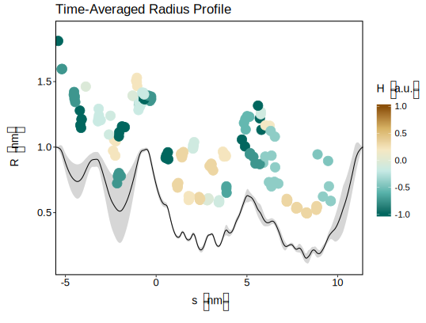

[JSON-spec]: https://www.json.org/
[R-main]: https://www.r-project.org/about.html
[ggplot]: http://ggplot2.org/
[add-path]: https://unix.stackexchange.com/questions/26047/how-to-correctly-add-a-path-to-path
[rstudio]: https://www.rstudio.com/


This page will walk you through loading CHAP output data into R and show you how to visualise the radius profile of the permeation pathway. It also introduces a set of turnkey scripts bundled with CHAP that you can use to quickly visualise CHAP data. These scripts are a good starting point for getting an overview of the data CHAP generates and can be adapted to suit your needs. It is assumed that you have some basic understanding of the [R language][R-main] and the [ggplot2][ggplot] plotting system.


## Example: Plotting Time-averaged Pathway Profiles

As CHAP writes all relevant data into a single [JSON][JSON-spec] file, you need to load a JSON parser first. There are several available in R; here we will use `jsonlite`, which can be installed by typing `install.packages("jsonlite")`. The `output.json` file from CHAP can then be loaded via

```r
# load JSON parser:
library(jsonlite)

# load CHAP data:
dat <- fromJSON(readLines("output.json", n = 1), flatten = FALSE)
```

where `flatten` is set to `FALSE` to preserve the structure of the JSON data. You can now use `names(dat)` to get an overview of the data contained in `output.json`.

The data on the time-averaged radius profile can be found in `dat$pathwayProfile` and can be plotted using `ggplot` by typing (make sure to load `library(ggplot2)` first):

```r
plt <- ggplot(data = as.data.frame(dat$pathwayProfile),
       		  aes(x = s,
              y = radiusMean)) + 
  geom_line() +
  xlab("s (nm)") + 
  ylab("R (nm)")
```

This will create a plot object named `plt`, which only contains the mean radius profile averaged over all trajectory frames, but it is very easy to add a confidence interval:

```r
plt +
  geom_ribbon(aes(x = s,
                  ymin = radiusMean - radiusSd, 
                  ymax = radiusMean + radiusSd), 
              alpha = 0.2) 
```

The above will create a grey area around the mean line, which indicates the one standard deviation confidence interval.

In addition to the radius profile, it is interesting to also look at the residues lining the permeation pathway. A data frame for the residue data in the CHAP output can be created by typing 

```r
res.data <- as.data.frame(dat$residueSummary)
```

and the residue positions can be added to the radius profile via:

```r
plt +
  geom_point(data = res.data[res.data$poreFacing.mean > 0.5,],
             aes(x = s.mean,
                 y = rho.mean,
                 colour = hydrophobicity)) +
  scale_colour_distiller(palette = "BrBG",
                         name = "H (a.u.)",
                         limits = c(-max(abs(data$hydrophobicity)), 
                                    max(abs(data$hydrophobicity)))) 
```

Note that this will only plot residues that are facing the pore more than 50% of the time and that residues are coloured by their respective hydrophobicity.

The above commands will generate a plot that (together with some further visual tweaking) will look like the following:



A similar procedure can be used to create plots of other pathway properties such as its hydrophobicity or the local solvent density. Take a look at `chap/scripts/plotting/R/chap_plot_pathway_profile.R` for an overview of what other pathway properties can be plotted.


## Turnkey Plotting Scripts

To get a quick overview of the results of a CHAP run you can use the plotting scripts available under `chap/scripts/plotting/R/`. There are three scripts, `chap_plot_pathway_profile.R`, `chap_plot_scalar_time_series.R`, and `chap_plot_profile_time_series.R`, each of which generates a set of figures that display time-averaged pathway profiles, scalar-valued time series, and vector-valued time series respectively.

The scripts require R to be installed and the `Rscript` command to be available. They also need the `optparse`, `jsonlite`, and `ggplot2` libraries and will install them automatically from CRAN if they are not found. The easiest way to use the scripts is to copy them into your working directory, where you can run them by simply typing

```bash
./chap_plot_pathway_profile.R -filename output.json -dpi 300
./chap_plot_scalar_time_series.R -filename output.json -dpi 300 
./chap_plot_profile_time_series.R -filename output.json -dpi 300
```

This will read data from `output.json` and create PNG figures with a resolution of 300 dots per inch. Both arguments are optional and default to `output.json` and `300` respectively. To avoid copying the scripts to your working directoy each time you generate new data, you may consider [adding the script location to your PATH][add-path]. Of course, you can also open and run the scripts from an R IDE such as [RStudio][rstudio].
